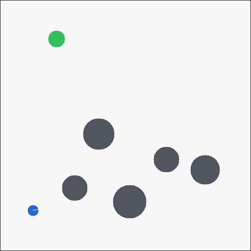
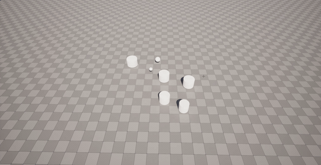

# cpp-gym-nav

[](https://github.com/KarimAmer45/cpp-gym-nav/actions/workflows/ci.yml)

A deterministic mobile-robot navigation simulator written in C++17, exposed to Python with
pybind11, and packaged as a standards-compliant Gymnasium environment. It is an intentionally small
portfolio environment for studying simulator correctness, reinforcement learning, performance, and
incremental realism.

The MVP includes the C++ simulator, NumPy binding, Gymnasium registration, PPO scripts, reproducible
benchmarks, RGB rendering, four opt-in realism features, native/Python tests, and cross-platform CI.
The Unreal integration is realized as a swappable socket backend: a versioned protocol and a
`NavEnvUnreal` env (tested for bit-exact parity against the C++ core) let the same training code drive
an Unreal process without change — the remaining editor-side scene is documented in
[docs/unreal.md](docs/unreal.md).



## Results

On 100 held-out seeds with randomized obstacle layouts (the default), PPO trained for 200,000 steps
reached the goal in **66%** of episodes; a seeded random policy reached it in **0%**. On the fixed
reference map the same recipe reaches **72%** — the small gap (66% vs 72%, with collisions rising from
14% to 31%) is evidence the policy learned reactive lidar navigation rather than memorizing one layout.
Training took ~120 seconds on a CPU-only machine. With all four realism features enabled (on the fixed
map, to isolate noise from layout variation) the recipe still reached 33% success and transferred to
clean dynamics at 35% — see [docs/benchmarks.md](docs/benchmarks.md). The checked-in artifacts are the
[learning curve](assets/generated/learning_curve.png) and
[evaluation data](assets/generated/evaluation.json).

| Python-visible configuration | Steps/s | p50 step (us) | p95 step (us) |
|---|---:|---:|---:|
| Gymnasium wrapper, single environment | 19,268 | 37.40 | 39.40 |
| Gymnasium `SyncVectorEnv`, 16 environments | 21,110 | 45.84 | 48.84 |
| Native C++ batch, 16 environments | **860,916** | **0.70** | **0.78** |

Native batching advances all 16 worlds per Python crossing and yields 44.7x the single-environment
aggregate throughput. These are honest wall-clock results from this checkout, not portable promises;
see [docs/benchmarks.md](docs/benchmarks.md) for the method and machine metadata.

Wired into PPO through a custom Stable-Baselines3 `VecEnv` (`train_ppo.py --native-vec 16`), the batched
step trains **4.4x** faster than the single-environment setup (200k steps: ~116 s down to ~27 s). About
1.3x of that is the native batch over a standard Python-loop `VecEnv` -- the policy update, not the
environment, is the training bottleneck. Reproduce with `python train/benchmark.py --training`.

## Quick start

Requirements: Python 3.11+, CMake 3.24+, and a C++17 compiler.

```bash
python -m venv .venv
# Windows: .venv\Scripts\activate
# Linux/macOS: source .venv/bin/activate
python -m pip install --upgrade pip
python -m pip install -e ".[test]"
python -m pytest
```

Check registration and drive one transition:

```python
import gymnasium as gym
import cpp_gym_nav

env = gym.make(cpp_gym_nav.ENV_ID, render_mode="rgb_array")
observation, info = env.reset(seed=5951)
observation, reward, terminated, truncated, info = env.step(env.action_space.sample())
frame = env.render()
env.close()
```

The package registers `CppGymNav-v0`. Its normalized continuous action is `[linear, angular]` in
`[-1, 1]`; the wrapper scales it to the configured physical speed limits. Its observation contains six
navigation/body features followed by 16 normalized lidar beams. `terminated` means goal or collision.
`truncated` means the 300-step budget expired.

If you drive the C++ core directly, note the two backends use different action conventions:
`_core.World.step` takes **physical-unit** actions (clamped to the speed limits), while
`_core.BatchWorld.step` takes **normalized** `[-1, 1]` actions and scales them internally. The
Gymnasium wrapper always presents the normalized interface, so this only matters for direct `_core` use.

## Architecture

```text
Stable-Baselines3 PPO
        |
Gymnasium NavEnv (contract, validation, render, time limit)
        |
pybind11 / NumPy (GIL released during C++ compute)
        |
C++17 World (kinematics, collision, raycast lidar, seeded RNG)

  ── or, over a versioned TCP socket (same normalized reset/step schema) ──
NavEnvUnreal → reference backend (C++ core today; an Unreal process tomorrow)
```

The core uses fixed-size obstacle and delay buffers and preallocates its observations. The binding
returns an owning NumPy copy to prevent later simulator steps from mutating observations retained by
an RL library.

## Correctness, safety, and reproducibility

- Gymnasium's checker and Stable-Baselines3's checker run in `pytest` and CI.
- A seed controls starts, goals, obstacle layouts, lidar noise/dropout, and wheel slip.
- Non-finite actions become zero and out-of-bounds actions are clamped; `info["action_clipped"]`
  records intervention.
- Every returned observation is checked for shape, finiteness, dtype, and bounds.
- Progress reward is the decrease in a potential, so driving in a circle cannot farm net progress.
- C++ and Python regression tests cover replay, API semantics, realism flags, and rendering.

See [docs/design.md](docs/design.md) for design choices, reward-hacking risks, and the Unreal boundary.

## Realism experiments

Use `NavEnvConfig` to enable features independently:

```python
from cpp_gym_nav import NavEnv, NavEnvConfig

env = NavEnv(config=NavEnvConfig(
    random_obstacles=True,  # per-episode layouts (default); False = fixed reference map
    sensor_noise=True,
    actuator_limits=True,
    action_delay=True,
    dynamics_randomization=True,
))
```

Flags-off behavior is protected by a baseline regression test. Sensor noise includes Gaussian noise,
dropout, and quantization; actuator limits bound acceleration; action latency uses a one- or two-step
queue; domain randomization jitters obstacle positions and adds seeded slip.

## Measure performance

Run the native tests/microbenchmark and the Python-visible benchmark:

```bash
python scripts/run_cpp_tests.py
python train/benchmark.py --steps 100000 --vector-envs 16
```

`benchmark-results.json` contains platform metadata, steps/second, and mean/p50/p95 latency.
`SyncVectorEnv` is a compatibility baseline, while `BatchWorld` is the optimized binding that removes
per-world Python crossings. Record the target machine and compiler with every published result.

## Train PPO

```bash
python -m pip install -e ".[train]"
python train/train_ppo.py --steps 200000
python train/evaluate.py assets/generated/ppo_nav.zip
tensorboard --logdir assets/generated/tensorboard
```

Training writes the model, evaluation JSON, TensorBoard logs, learning curve, and an optional agent
GIF under `assets/generated/`. Report success rate over held-out seeds; do not treat training return
alone as evidence of solving the task.

## Unreal bridge

`NavEnvUnreal` implements the identical Gymnasium contract over a versioned TCP protocol, so the same
training code drives a swappable backend. A reference server backed by the C++ core makes it
self-contained and testable (bit-exact parity with the in-process env, `check_env` green):

```bash
python -m cpp_gym_nav.backend_server --port 8917   # or NavEnvUnreal() auto-launches it in-process
```

```python
import gymnasium as gym, cpp_gym_nav

env = gym.make(cpp_gym_nav.UNREAL_ENV_ID)  # same PPO/eval code, backend over a socket
```

Swap the reference server for an Unreal Engine process answering the same protocol and nothing on the
Python side changes. Protocol spec and a UE5 C++ integration stub: [docs/unreal.md](docs/unreal.md).

### Unreal renderer

The complementary "UE as renderer" path keeps physics and RL in the proven C++ core and uses Unreal
only to visualize. `train/stream_unreal.py` runs the trained policy and streams world state (robot
pose, goal, obstacles) over the newline-delimited JSON/TCP protocol to a UE5 scene whose
`ANavRenderBridge` actor moves matching actors each tick. The same PPO policy trained against the C++
environment drives the Unreal scene through a fixed camera:



The bridge actor, coordinate mapping (sim metres to UE centimetres), and editor setup are documented
in [docs/unreal.md](docs/unreal.md).

## Repository map

- `cpp/include/nav` and `cpp/src`: simulator core
- `bindings`: pybind11/NumPy boundary
- `python/cpp_gym_nav`: Gymnasium env, registration, native `VecEnv`, and the socket bridge
  (`nav_env_unreal.py`, `backend_server.py`)
- `tests` and `cpp/tests`: contract, regression, and core tests
- `train`: PPO, evaluation/GIF, and benchmark scripts
- `docs/design.md` and `docs/unreal.md`: trade-offs/safety and the Unreal bridge protocol + stub
- `.github/workflows/ci.yml`: Linux/Windows build and test matrix

## Development

```bash
python -m pip install -e ".[dev]"
ruff check python tests train scripts
ruff format --check python tests train scripts
```

The implementation follows the current official contracts documented by
[Gymnasium](https://gymnasium.farama.org/main/api/env/),
[pybind11](https://pybind11.readthedocs.io/en/stable/compiling.html),
[scikit-build-core](https://scikit-build-core.readthedocs.io/), and
[Stable-Baselines3](https://stable-baselines3.readthedocs.io/en/master/guide/custom_env.html).

## License

MIT.
